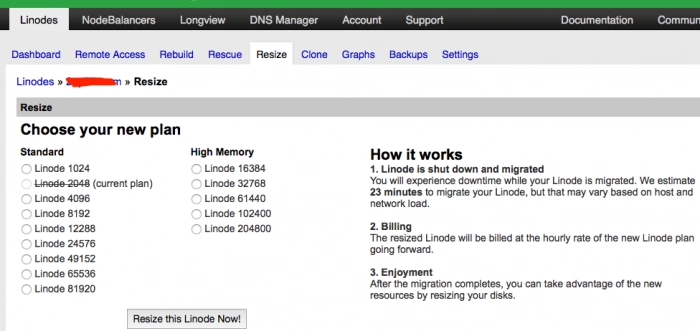
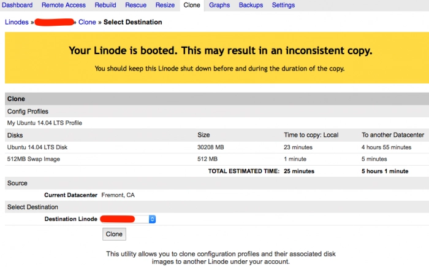
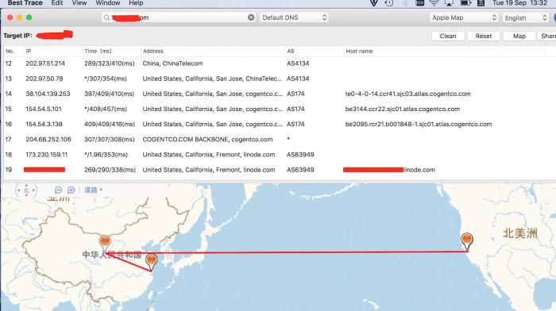
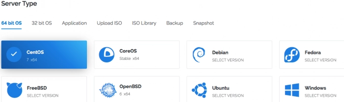
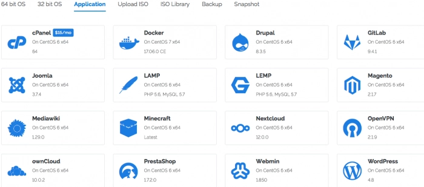
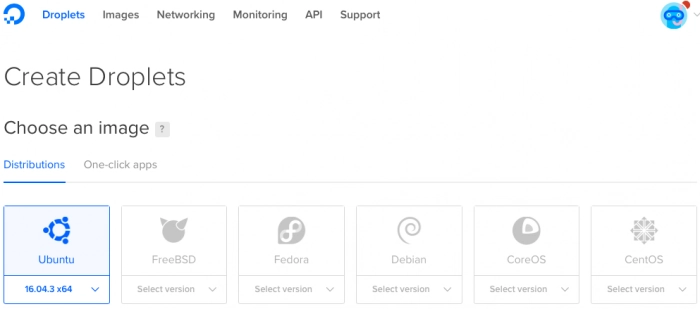
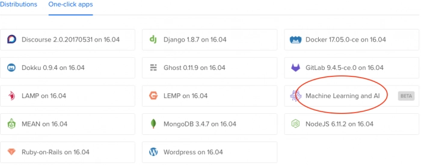

# Vultr vs Linode vs DigitalOcean：三大VPS服务商深度对比

---

做了这么多年开发，测过的VPS服务商没有一百也有几十个了。亚马逊AWS、微软Azure、谷歌云这些巨头确实稳定，但价格贵得让人肉疼——对个人开发者和小团队来说，根本不是理性选择。

测试过程中踩过不少坑。有些服务商用超低价格吸引你，结果数据说丢就丢。但也有几家确实靠谱：Vultr、DigitalOcean和Linode，我从它们刚进入VPS市场就开始用了。还记得Vultr刚开业那会儿，充100送100，账户直接变200美元——那才是真正的黄金时代。

这篇文章会从公司背景、CPU性能、磁盘速度、网络表现等维度，帮你搞清楚这三家到底谁更值得选。

---

## 数据中心分布：覆盖范围决定访问速度

| 区域 | Vultr（2014年成立） | Linode（2003年成立） | DigitalOcean（2011年成立） |
|------|---------------------|----------------------|----------------------------|
| 美洲 | 亚特兰大、芝加哥、硅谷、达拉斯、洛杉矶、纽约、西雅图、迈阿密 | 弗里蒙特、达拉斯、亚特兰大、纽瓦克 | 纽约、旧金山、多伦多（加拿大） |
| 欧洲 | 伦敦、阿姆斯特丹、巴黎、法兰克福 | 伦敦、法兰克福 | 伦敦、法兰克福、阿姆斯特丹 |
| 亚洲 | 东京、新加坡 | 东京、新加坡、孟买（印度） | 新加坡、班加罗尔（印度） |
| 其他 | 悉尼（澳大利亚） | - | - |

**Linode**是三家中资历最老的，2003年就开始做了。创始团队和员工持股，没有外部资本干预。早期用Xen虚拟化，两年前全面切换到KVM。面对竞争压力，Linode把内存和带宽翻倍，但价格基本没涨。支付方式也升级了，信用卡和PayPal都能用。

**DigitalOcean**成立于2011年，背后是美国风投支持。服务器主要集中在美国和欧洲，全部采用KVM虚拟化+SSD存储。他们把VPS叫做"Droplet"，创建速度快得离谱——通常15秒就能搞定。

**Vultr**是2014年Choopa LLC推出的子品牌（查IP归属会显示Choopa LLC）。虽然年轻，但野心很大：价格便宜、性能强悍、数据中心数量全球最多。全部采用KVM虚拟化技术。

---

## 价格对比：配置相似，细节有差异

| 价格 | Vultr | Linode | DigitalOcean |
|------|-------|--------|--------------|
| $5/月 | 25GB SSD<br>1核CPU<br>1GB内存<br>1TB流量 | 25GB存储<br>1核CPU<br>1GB内存<br>1TB流量 | 25GB SSD<br>1核CPU<br>1GB内存<br>1TB流量 |
| $10/月 | 40GB SSD<br>1核CPU<br>2GB内存<br>2TB流量 | 50GB存储<br>1核CPU<br>2GB内存<br>2TB流量 | 50GB SSD<br>1核CPU<br>2GB内存<br>2TB流量 |
| $20/月 | 60GB SSD<br>2核CPU<br>4GB内存<br>3TB流量 | 80GB存储<br>2核CPU<br>4GB内存<br>4TB流量 | 80GB SSD<br>2核CPU<br>4GB内存<br>4TB流量 |

**注意**：Vultr有个$2.5/月的套餐（20GB SSD、1核CPU、512MB内存、500GB流量），但常年缺货。

---

## CPU性能测试：Vultr意外领先

先看看三家用的CPU型号：

| 服务商 | CPU型号 | 单线程Passmark跑分 |
|--------|---------|-------------------|
| Vultr | Intel Xeon E5-2620 v3 | 1710 |
| Linode | Intel Xeon E5-2680 v2 @ 2.80GHz | 1758 |
| DigitalOcean | Intel Xeon E5-2650L v3 @ 1.80GHz | 1344 |

跑个sysbench基准测试（计算20000以内的质数）：

```bash
sysbench --test=cpu --cpu-max-prime=20000 --num-threads=1 run
```

结果很明显：

| 服务商 | 单线程耗时 |
|--------|-----------|
| Vultr | 30.7秒 |
| Linode | 33.2秒 |
| DigitalOcean | 45.8秒 |

👉 [如果你的项目对CPU性能要求高，Vultr的表现确实更出色](https://www.vultr.com/?ref=9738262-9J)

当然，基准测试不能100%代表真实场景，但至少能看出大致水平。

---

## 磁盘性能：Vultr的I/O速度碾压对手

三家都用SSD作为默认存储，比老式HDD快太多了。用fio脚本测试随机读写：

```bash
fio --name=randwrite --ioengine=libaio --iodepth=16 --rw=randwrite --bs=4k --direct=1 --size=512M --numjobs=8 --runtime=240 --group_reporting
fio --name=randread --ioengine=libaio --iodepth=16 --rw=randread --bs=4k --direct=1 --size=512M --numjobs=8 --runtime=240 --group_reporting
```

测试结果：

| 磁盘性能 | DigitalOcean | Linode | Vultr |
|----------|--------------|--------|-------|
| 写入速度 | 19.2MB/s | 34.3MB/s | **136.78MB/s** |
| 读取速度 | 218.4MB/s | 162.75MB/s | **231.9MB/s** |
| 写入IOPS | 4.82 | 8.52 | **28.3** |
| 读取IOPS | 53.7 | 41.7 | **59.2** |

Vultr的I/O性能直接把另外两家甩开几条街。不过要注意，磁盘测试结果会受邻居服务器影响（所谓"吵闹邻居"问题）。

---

## 备份策略：Linode最完善，Vultr最便宜

**Linode**提供4个备份槽位：
- 3个自动备份（每日备份、2-7天前备份、8-14天前备份）
- 1个手动快照（不会被自动覆盖）
- 可以恢复到账户下任何节点
- 收费标准：节点价格的**25%**（$10套餐每月额外收$2.5）
- 手动快照目前免费

**DigitalOcean**提供5个自动备份槽位：
- 收费标准：节点价格的**20%**（$5套餐每月额外收$1）
- 快照按使用空间收费：$0.05/GB/月
- 不足一个月按小时计费

**Vultr**的备份功能相对简单：
- 手动快照功能仍在测试阶段，目前免费
- 自动备份收费：节点价格的**20%**
- 备份存储在同数据中心的独立容错系统
- 可配置备份频率（每日/隔日/每周/每月）
- 只保留最近2次备份
- **只能整机恢复，不能恢复单个文件**

---

## 扩容与迁移：Linode的Clone功能最实用

**Linode**的扩容和迁移很方便：
- 几次点击就能完成扩容
- 跨数据中心迁移需要提交工单
- 缩容需要先关机、调整磁盘大小、再重启



Linode的**Clone功能**特别好用：可以把配置文件和磁盘镜像精确复制到另一个节点，甚至可以跨数据中心克隆。不需要重新配置网络，省了大量时间。



**DigitalOcean**的迁移限制比较多：
- 只能升级，不能降级
- 只能升级内存和CPU
- 跨数据中心迁移需要通过快照恢复

**Vultr**也只允许升级到更大套餐，迁移同样需要通过快照。

---

## 网络性能：Vultr略胜一筹

网络速度受很多因素影响：服务商的实际带宽、传输提供商、BGP对等连接等。用Cachefly的测试文件跑个下载速度测试：

```bash
wget -O /dev/null http://cachefly.cachefly.net/100mb.test
```

三家的网络配置：
- DigitalOcean：每个Droplet配备**10GbE**
- Vultr：大部分数据中心配备**10GbE**
- Linode：升级到**1GbE**出口

测试结果：

| 网络速度 | Vultr | Linode | DigitalOcean |
|----------|-------|--------|--------------|
| Cachefly下载 | 227MB/s | 220MB/s | 197MB/s |

**给亚洲用户的建议**：选东京或新加坡节点（三家都有）。欧美用户可以考虑阿姆斯特丹、法兰克福、弗里蒙特、洛杉矶。

网络速度因地区和ISP而异。推荐用BestTrace工具查看你和服务器之间的路由路径：



---

## 操作系统选择：Vultr最灵活

**Linode**的特点：
- 提供最新Linux内核（CentOS、Ubuntu、Arch、Debian、Fedora、openSUSE、Slackware）
- 默认使用Linode定制内核（可切换回原版内核）
- 所有节点共享一个**流量池**（管理多台服务器时很方便）
- 支持创建**子账户**并设置权限（适合团队管理）
- 默认启用**Google BBR拥塞算法**（提升TCP网络速度）

**Vultr**的优势：
- 支持32位和64位系统（Ubuntu、CentOS、Debian、FreeBSD）
- 提供Windows Server 2012 R2 x64（需额外付费）
- 支持**自定义ISO镜像**（可以上传或从URL下载）



Vultr的一键应用：



**DigitalOcean**的选择相对较少：
- Ubuntu、Debian、CentOS、Fedora（32位和64位）
- 不再支持Arch Linux
- 可以用快照、备份或最近销毁的Droplet创建新实例



DigitalOcean有个有趣的一键应用：**机器学习和AI**



---

## 总结：根据需求选择最合适的

测试下来，Vultr的成长速度确实惊人。它的性价比比Linode和DigitalOcean都高：SSD和网络速度快得离谱，最低$2.5/月就能用（512MB内存、500GB流量、20GB SSD）。不过备份功能比较简单，API文档也不够完善。

Linode依然提供稳定可靠的服务，价格合理，网络速度高。升级了支付方式，支持信用卡和PayPal。Clone功能很好用，但定制内核需要花时间调整。

DigitalOcean相比之下比较中庸。创建Droplet速度快、操作简单，但定价需要更新，数据中心选择也不多。

**具体建议**：
- **磁盘性能优先**：选Vultr
- **灵活配置和批量部署**：Linode和Vultr都不错，DigitalOcean排最后
- **完善的备份服务**：推荐Linode

如果你需要一个在全球多个地区都有稳定表现、性价比高的VPS服务商，👉 [Vultr是个很难被超越的选择](https://www.vultr.com/?ref=9738262-9J)。它的磁盘I/O性能、网络速度和数据中心覆盖范围，都能满足大部分开发者和小团队的需求。
